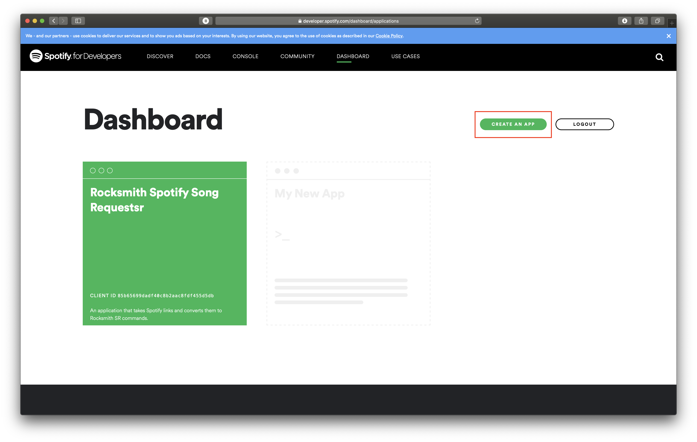
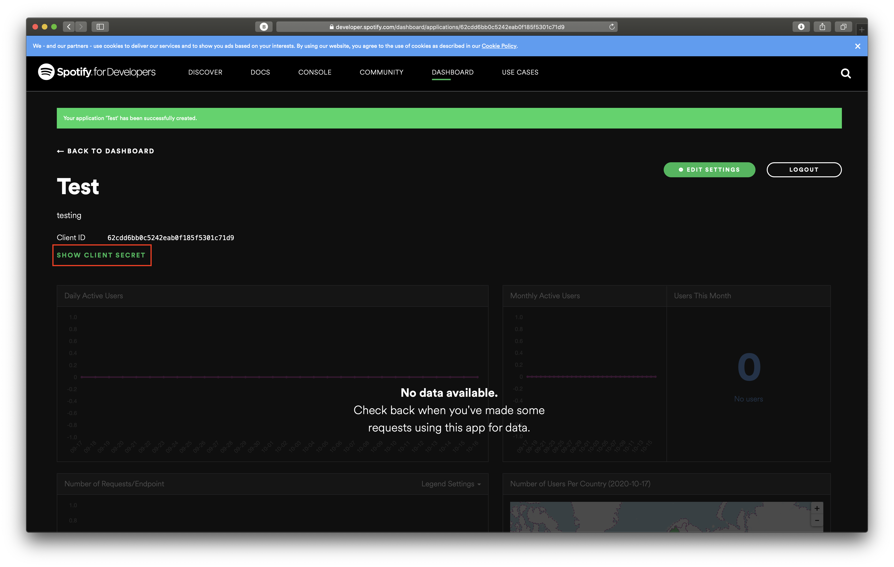

# Rocksmith Spotify Song Requester (RSSSR)

Rocksmith Spotify Song Requester allows for user in Twitch chat to use Spotify
links to request songs for Rocksmith streamers to play.

## Setup

### Requirements

1. A Twitch account to serve as a bot
2. A Spotify developer account and application

### Creating a Spotify Developer Account & Application

1. Navigate to [developer.spotify.com](https://developer.spotify.com/dashboard/)
2. Login to your account or create an account
3. Click the "CREATE AN APP" button
   
4. Provide a name, description, and agree to the terms & services
5. Click the "SHOW CLIENT SECRET" button
   
6. Copy your Client ID & Secret and save them for later